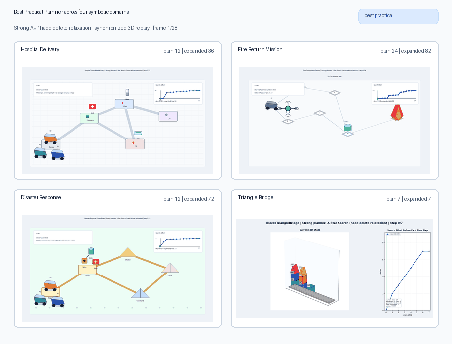
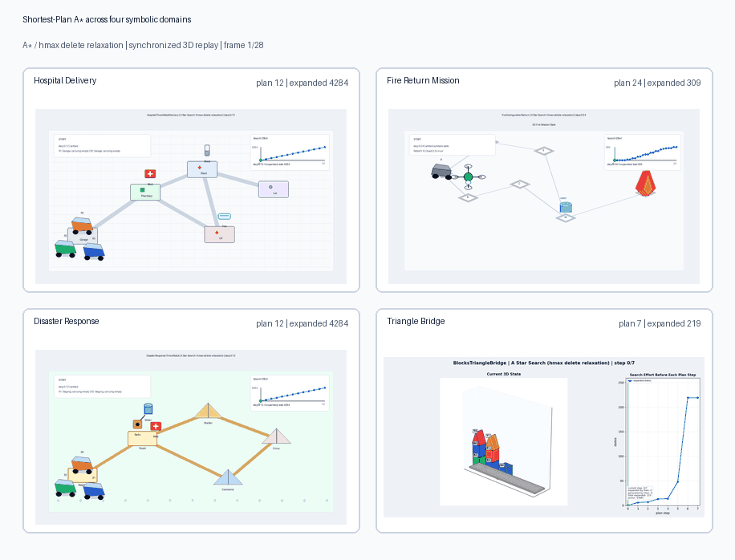
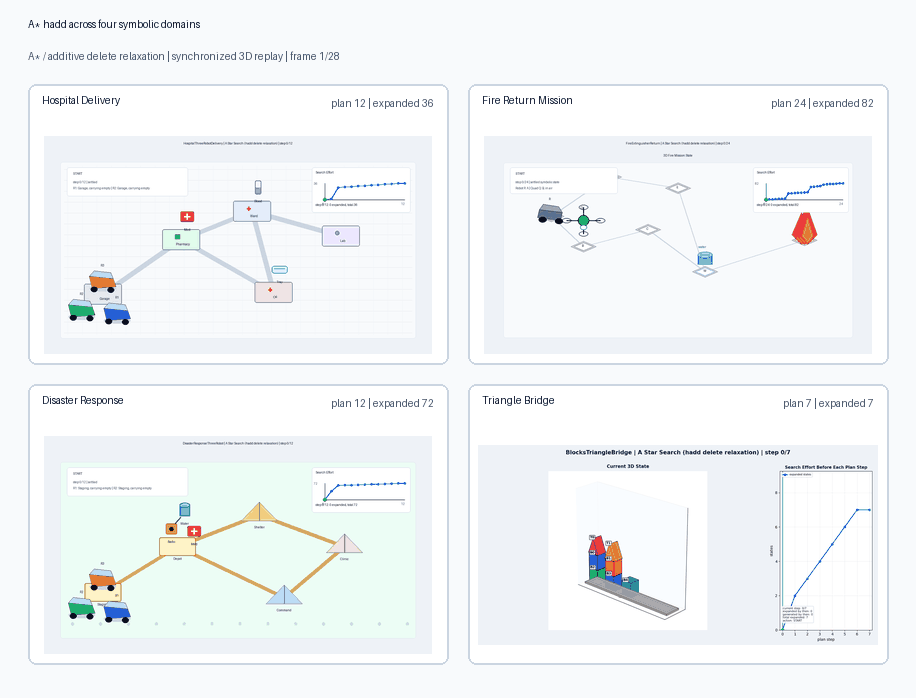
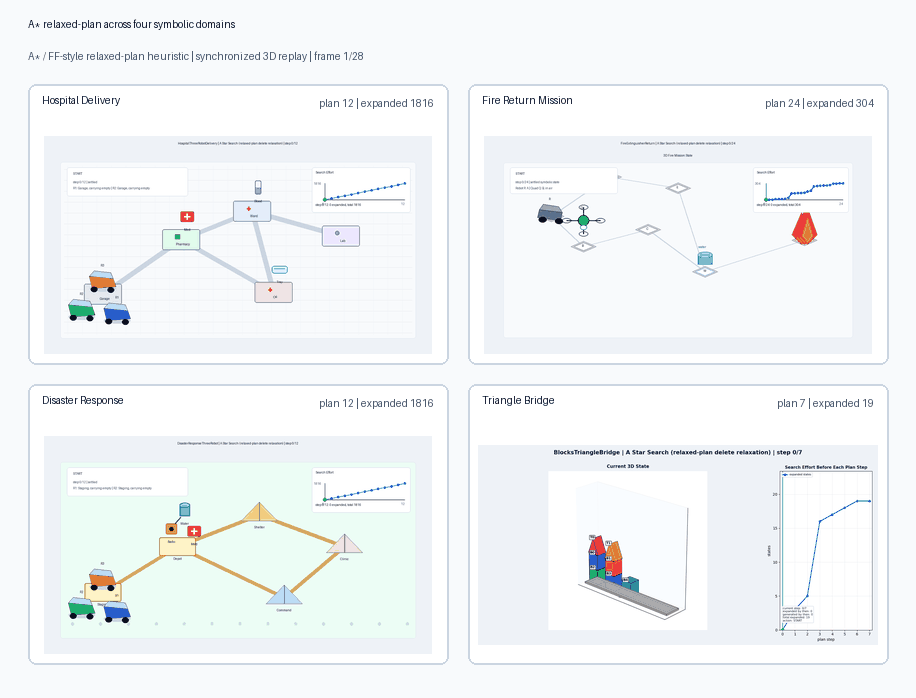
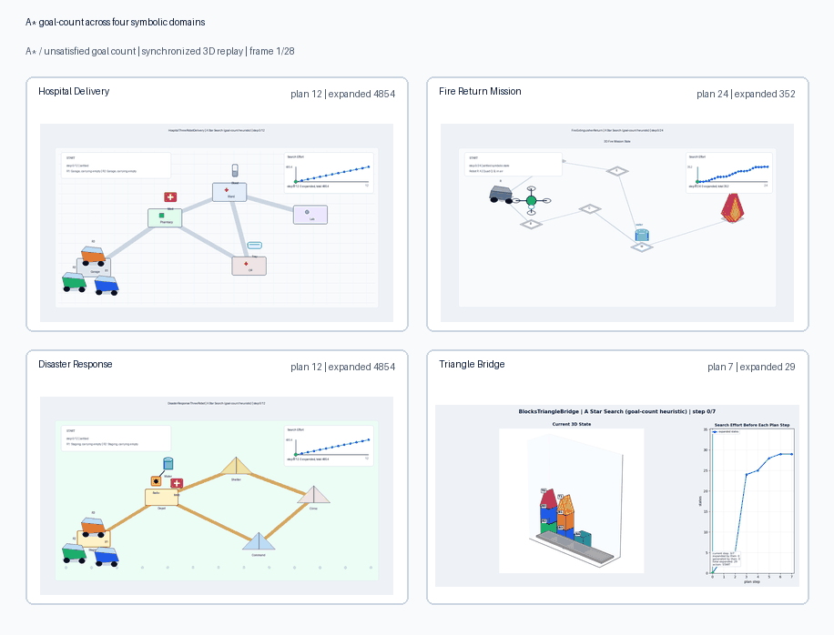
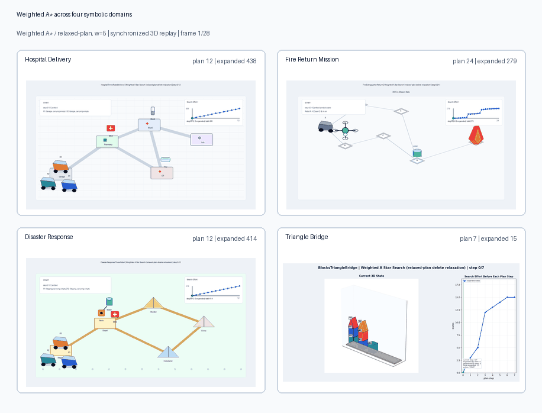
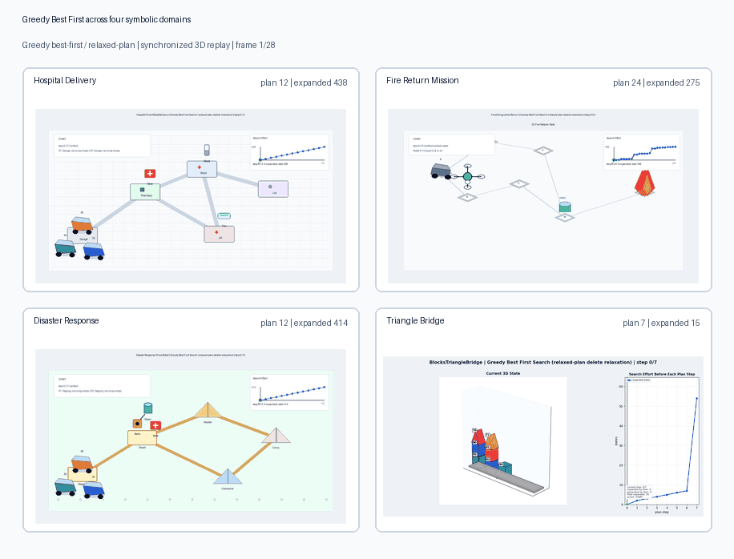
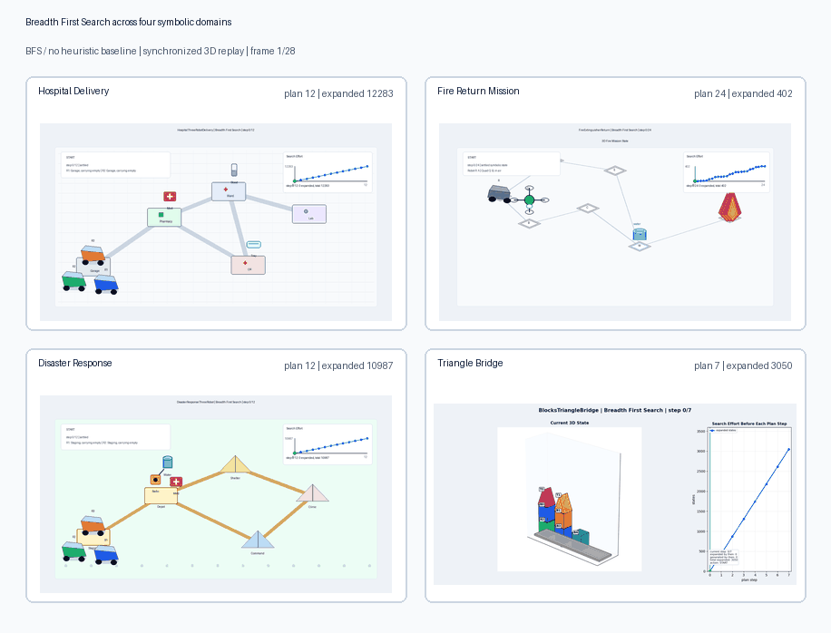
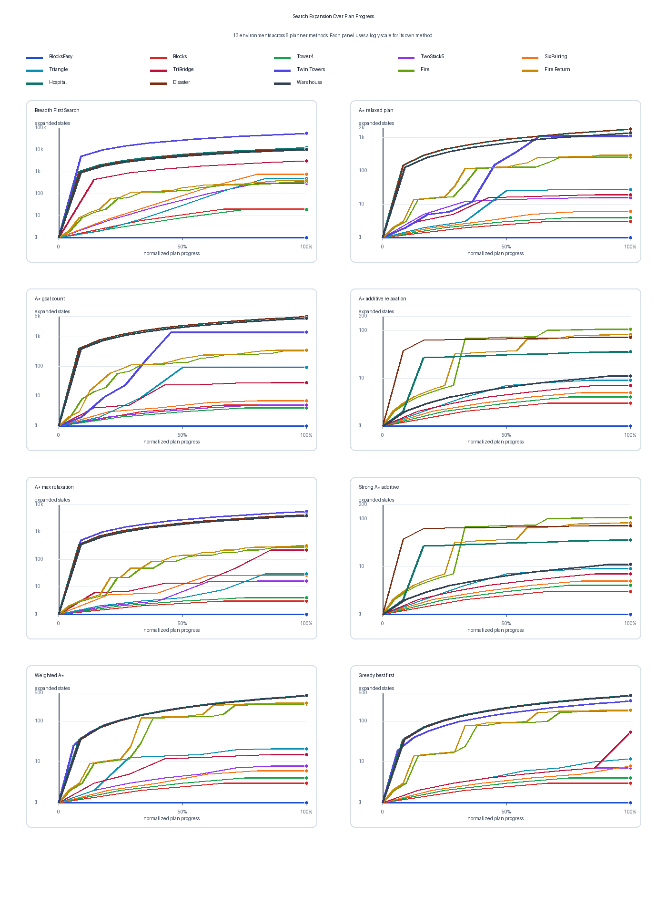

# Symbolic Planner

Author: Varun Moparthi

## Abstract

Symbolic planning is a way to reason about action before committing to low level
motion or control. A task is described through named objects, logical facts, and
operators that change those facts. Instead of asking where every physical point
should move at every instant, the planner asks which relations must become true:
which object is on which support, which robot has which item, which location has
been reached, or which resource condition enables the next action.

This abstraction is powerful because it exposes the causal structure of a task.
Preconditions state what must already be true before an action is meaningful,
while effects state what becomes true or false after the action is applied. A
valid plan is therefore not just a list of commands; it is a proof that each
action is justified by the facts produced before it, and that the final state
logically entails the desired goal.

The same symbolic model can represent block rearrangement, delivery logistics,
and robot assisted emergency response without changing the underlying planning
language. What changes is the vocabulary of predicates and actions. This makes
symbolic planning especially useful for high level robot task planning, where
the central problem is often choosing a correct sequence of meaningful actions
under object, location, resource, and ordering constraints.

## Output Gallery

The combined GIFs below show the same planner method across four representative
environments: `HospitalThreeRobotDelivery`, `FireExtinguisherReturn`,
`DisasterResponseThreeRobot`, and `BlocksTriangleBridge`.

### Best Practical Planner: Strong A* hadd



### Shortest Plan Planner: A* hmax



### A* hadd



### A* relaxed plan



### A* goal count



### Weighted A*



### Greedy Best First Search



### Breadth First Search Baseline



### Search Expansion Panel



This static panel compares search effort across all 13 environments and all 8
planner methods. Each curve is one environment, and each planner method gets its
own subplot.

## Repository Layout

```text
.
|-- CMakeLists.txt
|-- LICENSE
|-- README.md
|-- build/
|   `-- planner
|-- envs/
|   |-- Blocks.txt
|   |-- BlocksTriangle.txt
|   |-- FireExtinguisher.txt
|   |-- HospitalThreeRobotDelivery.txt
|   |-- DisasterResponseThreeRobot.txt
|   `-- WarehouseThreeRobotFulfillment.txt
|-- include/
|   `-- symbolic_planner/
|       |-- grounding.hpp
|       |-- heuristics.hpp
|       |-- parser.hpp
|       |-- search.hpp
|       |-- state.hpp
|       |-- transition.hpp
|       `-- types.hpp
|-- outputs/
|   |-- runs/
|   |-- summary.csv
|   |-- summary.json
|   `-- visualizations/
|-- papers/
|   |-- Paper.pdf
|   |-- symbolicplan_16782_fall25.pdf
|   |-- symbolicrep_16782_fall25.pdf
|   `-- ...
|-- scripts/
|   |-- render_expansion_summary_panel.py
|   |-- run_and_visualize.py
|   |-- visualize_search_comparison.py
|   `-- visualize_search_exploration.py
|-- src/
|   |-- astar_planner.cpp
|   |-- breadth_first_planner.cpp
|   |-- greedy_best_first_planner.cpp
|   `-- planner.cpp
`-- utils/
    |-- grounding.cpp
    |-- heuristics.cpp
    |-- parser.cpp
    |-- state.cpp
    `-- transition.cpp
```

The core executable is `build/planner`. The C++ code owns parsing, grounding,
state transitions, search, and heuristic evaluation. The Python scripts run the
benchmark matrix, replay plans, and generate visualization artifacts.

## Setup

From the project root:

```bash
cd /mntdatalora/src/Symbolic-Planner
cmake -S . -B build -DCMAKE_BUILD_TYPE=Release
cmake --build build --config Release
```

Install Python packages used by the visualization scripts:

```bash
python3 -m pip install --user matplotlib pillow
```

If `build/planner` already exists and the local machine does not have a compiler
installed, the visualization runner can reuse the existing binary:

```bash
python3 scripts/run_and_visualize.py --skip-build
```

## Running The Planner

Run one environment with the default BFS planner:

```bash
./build/planner Blocks.txt
```

Run one environment with a specific planner mode:

```bash
SYMBOLIC_PLANNER_MODE=strong ./build/planner BlocksTriangleTwinTowers.txt
SYMBOLIC_PLANNER_MODE=optimal ./build/planner FireExtinguisher.txt
SYMBOLIC_PLANNER_MODE=weighted_ff SYMBOLIC_PLANNER_WEIGHT=5 ./build/planner HospitalThreeRobotDelivery.txt
```

Run and visualize the full benchmark matrix:

```bash
python3 scripts/run_and_visualize.py --skip-build
```

Run only selected environments or methods:

```bash
python3 scripts/run_and_visualize.py --skip-build \
  --env Blocks.txt \
  --env WarehouseThreeRobotFulfillment.txt \
  --method bfs \
  --method strong
```

Generate the static 8-panel expansion summary:

```bash
python3 scripts/render_expansion_summary_panel.py
```

The main outputs are:

```text
outputs/runs/<Environment>/<Method>/plan.txt
outputs/runs/<Environment>/<Method>/metrics.json
outputs/runs/<Environment>/<Method>/trace.json
outputs/runs/<Environment>/<Method>/search_profile.json
outputs/visualizations/<Environment>/<Method>/
outputs/visualizations/summary/expansion_by_method_panel.png
outputs/summary.csv
outputs/summary.json
```

## Problem Model

### Planning Problem

Each environment defines a deterministic STRIPS planning problem:

$$
\Pi = \langle \mathcal{O}, \mathcal{P}, \mathcal{A}, s_0, G \rangle
$$

where $\mathcal{O}$ is the object set, $\mathcal{P}$ is the predicate
vocabulary, $\mathcal{A}$ is the set of lifted action schemas, $s_0$ is the
initial state, and $G$ is the goal condition.

The environment file maps directly onto that tuple:

| file component | mathematical role | example |
| --- | --- | --- |
| `Symbols` | objects $\mathcal{O}$ | `A`, `B`, `C`, `Table` |
| `Initial conditions` | initial state $s_0$ | `On(A,B)`, `Clear(A)` |
| `Goal conditions` | goal set $G$ | `On(B,C)`, `On(C,A)` |
| `Actions` | lifted schemas $\mathcal{A}$ | `Move(b,x,y)` |

### States And Goals

Let $\mathcal{F}$ be the finite set of all grounded facts that can be formed from
the predicates and objects. A symbolic state is a subset of those facts:

$$
s \subseteq \mathcal{F}
$$

The initial state and goal are also fact sets:

$$
s_0 \subseteq \mathcal{F},
\qquad
G \subseteq \mathcal{F}
$$

A state satisfies the goal exactly when all goal facts are true:

$$
s \models G
\quad \Longleftrightarrow \quad
G \subseteq s
$$

Search nodes are these fact sets. Two nodes are the same if their sorted fact
sets are identical.

### Actions And Grounding

A lifted action schema is written as:

$$
a(x_1,\ldots,x_k)
=
\langle \mathrm{Pre}(a), \mathrm{Add}(a), \mathrm{Del}(a) \rangle
$$

Grounding substitutes concrete objects for the schema variables:

$$
\theta : \{x_1,\ldots,x_k\} \rightarrow \mathcal{O}
$$

The grounded operator is:

$$
a\theta
=
\langle \mathrm{Pre}(a)\theta,\ \mathrm{Add}(a)\theta,\ \mathrm{Del}(a)\theta \rangle
$$

For example, the schema `Move(b,x,y)` can produce grounded actions such as
`Move(A,B,C)` or `Move(C,Table,A)`. A grounded action is applicable in state $s$
when:

$$
\mathrm{Pre}(a\theta) \subseteq s
$$

### Transition Function

For an applicable grounded action $a$, the successor state is:

$$
\mathrm{Succ}(s,a)
=
\left(s \setminus \mathrm{Del}(a)\right) \cup \mathrm{Add}(a)
$$

All planners in this repository use unit action cost, so shortest plans are
minimum length action sequences.

## Planner Methods

| method key | planner | heuristic | guarantee |
| --- | --- | --- | --- |
| `bfs` | Breadth first search | none | complete and shortest for finite unit cost tasks |
| `astar` | A* | relaxed plan delete relaxation | complete, not shortest guaranteed |
| `astar_goal` | A* | unsatisfied goal count | complete, weak heuristic baseline |
| `astar_hadd` | A* | additive delete relaxation, `h_add` | complete, not shortest guaranteed |
| `optimal` | A* | max delete relaxation, `h_max` | complete and shortest with unit action costs |
| `strong` | A* | additive delete relaxation, `h_add` | recommended practical mode, not shortest guaranteed |
| `weighted_ff` | weighted A* | relaxed plan heuristic, default weight 5 | satisficing, faster but not shortest guaranteed |
| `greedy_ff` | greedy best first search | relaxed plan heuristic | satisficing, prioritizes small heuristic value |

### Shared Search Notation

Let the planning problem be:

$$
\Pi = \langle \mathcal{F}, A, s_0, G \rangle
$$

where $\mathcal{F}$ is the finite set of possible grounded facts, $A$ is the
finite set of grounded actions, $s_0 \subseteq \mathcal{F}$ is the initial
state, and $G \subseteq \mathcal{F}$ is the goal fact set. A state is a set of
facts:

$$
s \subseteq \mathcal{F}
$$

Each grounded action has preconditions, add effects, and delete effects:

$$
a = \langle \mathrm{Pre}(a), \mathrm{Add}(a), \mathrm{Del}(a) \rangle
$$

An action is applicable when all positive preconditions are true:

$$
\mathrm{Applicable}(a,s)
\iff
\mathrm{Pre}(a) \subseteq s
$$

The successor function is:

$$
\gamma(s,a)
=
\left(s \setminus \mathrm{Del}(a)\right) \cup \mathrm{Add}(a)
$$

All planners use unit action cost:

$$
c(a)=1
$$

For a path from the start to state $s$, the path cost is therefore the number of
actions:

$$
g(s)=|\pi_{s_0 \rightarrow s}|
$$

The search goal test is:

$$
goal(s) \iff G \subseteq s
$$

### Breadth First Search (`bfs`)

BFS is the blind optimal baseline. It expands states by nondecreasing depth, so
the frontier at depth $d$ contains exactly the states reachable in $d$ actions
that have not already been visited:

$$
L_0=\{s_0\}
$$

$$
L_{d+1}
=
\{\gamma(s,a)\mid s\in L_d,\ a\in A,\ \mathrm{Applicable}(a,s)\}
\setminus Visited
$$

The first goal reached is therefore:

$$
s^*=\arg\min_{s:G\subseteq s}g(s)
$$

Since every action has unit cost, BFS is complete and shortest plan optimal on
these finite symbolic tasks. Its cost is that it has no preference for relevant
actions, so the number of expansions can approach the full reachable graph:

$$
O(|S|+|E|)
$$

If the average branching factor is $b$ and the shortest solution depth is $d^*$,
then the worst case number of generated nodes grows like:

$$
N_{BFS}(d^*)=\sum_{i=0}^{d^*} b^i
=
\frac{b^{d^*+1}-1}{b-1}
$$

That expression is the reason BFS becomes expensive in the multi robot domains.
It has to enumerate all shallow alternatives before it can commit to the action
sequence that actually moves the correct item to the correct destination. In the
tables below, `expanded` counts states removed from the frontier and tested for
successors, while `generated` counts new successor states inserted into the
frontier.

| environment | plan length | expanded | generated | time ms |
| --- | ---: | ---: | ---: | ---: |
| BlocksEasy | 1 | 1 | 5 | 0.3 |
| Blocks | 3 | 20 | 28 | 0.7 |
| BlocksTower4 | 4 | 19 | 52 | 1.1 |
| BlocksTwoStack5 | 5 | 287 | 630 | 15.8 |
| BlocksSixPairing | 5 | 764 | 2,515 | 62.6 |
| BlocksTriangle | 6 | 476 | 1,564 | 63.5 |
| BlocksTriangleBridge | 7 | 3,050 | 5,353 | 414.8 |
| BlocksTriangleTwinTowers | 11 | 56,160 | 69,773 | 9,412.5 |
| FireExtinguisher | 21 | 336 | 379 | 19.7 |
| FireExtinguisherReturn | 24 | 402 | 416 | 23.7 |
| HospitalThreeRobotDelivery | 12 | 12,283 | 15,518 | 6,292.3 |
| DisasterResponseThreeRobot | 12 | 10,987 | 13,934 | 5,856.7 |
| WarehouseThreeRobotFulfillment | 11 | 10,339 | 15,062 | 5,410.7 |

### A* Relaxed Plan Search (`astar`)

This planner uses A* with an FF style relaxed plan heuristic. A* ranks each open
state by:

$$
f(s)=g(s)+h_{rp}(s)
$$

The relaxed plan heuristic first removes delete effects:

$$
\gamma^+(s,a)=s\cup\mathrm{Add}(a)
$$

Then it builds monotone fact layers:

$$
F_0=s
$$

$$
F_{i+1}
=
F_i\cup
\{\mathrm{Add}(a)\mid a\in A,\ \mathrm{Pre}(a)\subseteq F_i\}
$$

Once $G\subseteq F_k$, the heuristic greedily extracts a relaxed support plan
$\pi^+$ and uses:

$$
h_{rp}(s)=|\pi^+|
$$

This is much more goal directed than BFS because it estimates which actions can
support missing facts. It is not admissible, so it is a complete graph search on
finite tasks but not a shortest plan proof.

The search still preserves the normal A* bookkeeping:

$$
g(s')=g(s)+1
$$

$$
best_g(s')=\min(best_g(s'),g(s'))
$$

A successor is useful only if it improves the best known cost for that symbolic
state. This prevents loops such as moving an item away and then immediately
moving it back from being expanded indefinitely. The important heuristic
difference from BFS is that $h_{rp}$ estimates a concrete relaxed action count,
so states that support multiple future goals receive lower priorities.

The relaxed plan extraction can be read as a backward support problem. Let
$Need_k=G$. Moving backward through the fact layers, selected actions add the
facts currently needed:

$$
a_i\in\arg\min_{a:\mathrm{Add}(a)\cap Need_i\ne\emptyset}
|\mathrm{Pre}(a)\setminus F_{i-1}|
$$

The needed set is then updated by replacing achieved facts with the selected
action preconditions:

$$
Need_{i-1}
=
(Need_i\setminus \mathrm{Add}(a_i))\cup \mathrm{Pre}(a_i)
$$

| environment | plan length | expanded | generated | time ms |
| --- | ---: | ---: | ---: | ---: |
| BlocksEasy | 1 | 1 | 5 | 0.7 |
| Blocks | 3 | 3 | 17 | 1.4 |
| BlocksTower4 | 4 | 4 | 12 | 2.2 |
| BlocksTwoStack5 | 6 | 16 | 118 | 21.7 |
| BlocksSixPairing | 5 | 6 | 62 | 17.5 |
| BlocksTriangle | 6 | 28 | 176 | 49.1 |
| BlocksTriangleBridge | 7 | 19 | 126 | 50.9 |
| BlocksTriangleTwinTowers | 11 | 1,148 | 7,947 | 5,446.2 |
| FireExtinguisher | 21 | 264 | 290 | 219.8 |
| FireExtinguisherReturn | 24 | 304 | 376 | 264.4 |
| HospitalThreeRobotDelivery | 12 | 1,816 | 6,160 | 17,825.4 |
| DisasterResponseThreeRobot | 12 | 1,816 | 6,160 | 9,358.7 |
| WarehouseThreeRobotFulfillment | 11 | 1,424 | 4,844 | 9,640.6 |

### A* Goal Count Search (`astar_goal`)

Goal count A* uses the number of unsatisfied goal facts:

$$
h_{goal}(s)=|\{p\in G\mid p\notin s\}|
$$

and ranks states by:

$$
f_{goal}(s)=g(s)+h_{goal}(s)
$$

This heuristic is cheap and often better than blind search, but it ignores
causal structure. It treats all missing goals equally even when one goal needs a
long action chain and another needs one action.

The heuristic value changes only when a goal fact becomes true or false:

$$
\Delta h_{goal}
=
|\{p\in G\mid p\notin s'\}|-|\{p\in G\mid p\notin s\}|
$$

That means many non goal enabling actions have no immediate heuristic reward. In
Blocksworld, clearing a buried block can be essential, but if the clearing move
does not directly create a goal fact, $h_{goal}$ may not decrease. The planner
therefore behaves like BFS across many plateaus:

$$
\{s\mid h_{goal}(s)=k\}
$$

It is also not generally admissible. One action can achieve several missing
goals, so counting each missing goal separately can overestimate the true
remaining distance:

$$
h_{goal}(s)>h^*(s)\quad\text{is possible}
$$

| environment | plan length | expanded | generated | time ms |
| --- | ---: | ---: | ---: | ---: |
| BlocksEasy | 1 | 1 | 5 | 0.3 |
| Blocks | 3 | 5 | 19 | 0.4 |
| BlocksTower4 | 4 | 4 | 12 | 0.7 |
| BlocksTwoStack5 | 5 | 5 | 30 | 1.2 |
| BlocksSixPairing | 5 | 7 | 65 | 2.2 |
| BlocksTriangle | 6 | 94 | 334 | 14.2 |
| BlocksTriangleBridge | 7 | 29 | 135 | 5.7 |
| BlocksTriangleTwinTowers | 11 | 1,452 | 4,916 | 269.0 |
| FireExtinguisher | 21 | 336 | 379 | 44.0 |
| FireExtinguisherReturn | 24 | 352 | 420 | 44.7 |
| HospitalThreeRobotDelivery | 12 | 4,854 | 7,731 | 5,479.3 |
| DisasterResponseThreeRobot | 12 | 4,854 | 7,731 | 2,977.8 |
| WarehouseThreeRobotFulfillment | 11 | 4,310 | 6,888 | 2,654.1 |

### A* Additive Delete Relaxation (`astar_hadd`)

The additive heuristic computes relaxed fact costs. True facts cost zero:

$$
c_s(p)=0\quad\text{if }p\in s
$$

Unknown facts start at infinity:

$$
c_s(p)=\infty\quad\text{if }p\notin s
$$

For an action, additive relaxed cost is:

$$
\mathrm{cost}_{add}(a)
=
1+\sum_{p\in\mathrm{Pre}(a)}c_s(p)
$$

If $a$ adds $q$, the fact cost is relaxed by:

$$
c_s(q)=\min(c_s(q),\mathrm{cost}_{add}(a))
$$

The state heuristic is:

$$
h_{add}(s)=\sum_{q\in G}c_s(q)
$$

and the A* priority is:

$$
f_{add}(s)=g(s)+h_{add}(s)
$$

`h_add` can over count shared subplans, so it is not admissible. In return, it
often strongly separates useful states from irrelevant states.

The computation is a fixed point over relaxed fact costs. Starting from the
current state facts, the update rule is repeatedly applied until no fact cost
decreases:

$$
c_s^{t+1}(q)
=
\min
\left(
c_s^t(q),
\min_{a:q\in\mathrm{Add}(a)}
1+\sum_{p\in\mathrm{Pre}(a)}c_s^t(p)
\right)
$$

Because delete effects are ignored, fact costs only decrease, and the process
converges after a finite number of decreases. The additive sum makes the
heuristic sensitive to the number of subgoals still requiring support:

$$
h_{add}(s_1)<h_{add}(s_2)
\Rightarrow
s_1\ \text{is estimated closer to satisfying all goals}
$$

The tradeoff is double counting. If one action supports two goals, the shared
cost can be counted twice. That makes the heuristic strong for guidance but
unsafe as an optimality proof.

| environment | plan length | expanded | generated | time ms |
| --- | ---: | ---: | ---: | ---: |
| BlocksEasy | 1 | 1 | 5 | 0.9 |
| Blocks | 3 | 3 | 17 | 1.9 |
| BlocksTower4 | 4 | 4 | 12 | 6.6 |
| BlocksTwoStack5 | 5 | 5 | 30 | 12.4 |
| BlocksSixPairing | 5 | 5 | 55 | 30.6 |
| BlocksTriangle | 6 | 9 | 64 | 43.9 |
| BlocksTriangleBridge | 7 | 7 | 61 | 42.0 |
| BlocksTriangleTwinTowers | 11 | 11 | 167 | 151.3 |
| FireExtinguisher | 21 | 107 | 219 | 140.3 |
| FireExtinguisherReturn | 24 | 82 | 246 | 151.4 |
| HospitalThreeRobotDelivery | 12 | 36 | 359 | 1,544.2 |
| DisasterResponseThreeRobot | 12 | 72 | 640 | 1,309.7 |
| WarehouseThreeRobotFulfillment | 11 | 11 | 133 | 298.4 |

### A* Max Delete Relaxation (`optimal`)

The `optimal` mode uses `h_max`, which changes the conjunction cost from a sum
to a maximum:

$$
\mathrm{cost}_{max}(a)
=
1+\max_{p\in\mathrm{Pre}(a)}c_s(p)
$$

Fact costs are still updated by:

$$
c_s(q)=\min(c_s(q),\mathrm{cost}_{max}(a))
$$

The heuristic is:

$$
h_{max}(s)=\max_{q\in G}c_s(q)
$$

Because max does not double count shared subplans, it is admissible:

$$
h_{max}(s)\le h^*(s)
$$

so A* with this heuristic returns shortest unit cost plans. The tradeoff is that
the heuristic is less aggressive than `h_add`, so it can expand more states or
spend more wall clock time evaluating states.

The fixed point equation for $h_{max}$ is:

$$
c_s^{t+1}(q)
=
\min
\left(
c_s^t(q),
\min_{a:q\in\mathrm{Add}(a)}
1+\max_{p\in\mathrm{Pre}(a)}c_s^t(p)
\right)
$$

Using max instead of sum means a conjunction is priced by its hardest relaxed
precondition, not by all preconditions together. This makes $h_{max}$ more
conservative:

$$
h_{max}(s)\le h_{add}(s)
$$

Conservatism is useful for optimality because it avoids charging twice for
shared relaxed work. It is less useful for pruning because many states can share
the same max cost even when one has many more unfinished subgoals.

| environment | plan length | expanded | generated | time ms |
| --- | ---: | ---: | ---: | ---: |
| BlocksEasy | 1 | 1 | 5 | 1.0 |
| Blocks | 3 | 3 | 17 | 2.1 |
| BlocksTower4 | 4 | 4 | 12 | 3.6 |
| BlocksTwoStack5 | 5 | 16 | 137 | 43.5 |
| BlocksSixPairing | 5 | 26 | 347 | 168.8 |
| BlocksTriangle | 6 | 30 | 239 | 169.1 |
| BlocksTriangleBridge | 7 | 219 | 1,270 | 746.8 |
| BlocksTriangleTwinTowers | 11 | 5,652 | 23,128 | 20,571.5 |
| FireExtinguisher | 21 | 275 | 301 | 217.7 |
| FireExtinguisherReturn | 24 | 309 | 400 | 337.9 |
| HospitalThreeRobotDelivery | 12 | 4,284 | 8,686 | 40,182.9 |
| DisasterResponseThreeRobot | 12 | 4,284 | 8,690 | 19,704.9 |
| WarehouseThreeRobotFulfillment | 11 | 3,884 | 7,734 | 34,586.6 |

### Strong Planner (`strong`)

The strong planner is the selected practical planner for this project. It uses
the same additive delete relaxation estimate as `astar_hadd`:

$$
h_{strong}(s)=h_{add}(s)
$$

and the same A* ranking:

$$
f_{strong}(s)=g(s)+h_{add}(s)
$$

The reason to keep it as a named mode is experimental clarity: it is the mode
used for the main qualitative visualizations and the mode that best balances
plan quality and search effort in the larger symbolic domains.

Mathematically, `strong` is the same evaluation function as additive A*:

$$
s_{next}
=
\arg\min_{s\in Open}
\left(g(s)+h_{add}(s)\right)
$$

The important behavior is how $h_{add}$ ranks parallel subgoals. For delivery
domains, a state with two unfinished deliveries receives roughly the sum of two
remaining relaxed delivery costs, while a state with one finished delivery and
one unfinished delivery receives a smaller estimate:

$$
h_{add}(s)
=
c_s(g_1)+c_s(g_2)+c_s(g_3)
$$

That is why the method can avoid expanding many states that move the wrong robot
or manipulate the wrong item. It is still not a proof of shortest plan length,
but in these benchmarks it usually keeps the optimal plan length while expanding
far fewer states.

| environment | plan length | expanded | generated | time ms |
| --- | ---: | ---: | ---: | ---: |
| BlocksEasy | 1 | 1 | 5 | 0.9 |
| Blocks | 3 | 3 | 17 | 2.0 |
| BlocksTower4 | 4 | 4 | 12 | 3.7 |
| BlocksTwoStack5 | 5 | 5 | 30 | 11.4 |
| BlocksSixPairing | 5 | 5 | 55 | 30.6 |
| BlocksTriangle | 6 | 9 | 64 | 41.5 |
| BlocksTriangleBridge | 7 | 7 | 61 | 44.2 |
| BlocksTriangleTwinTowers | 11 | 11 | 167 | 160.9 |
| FireExtinguisher | 21 | 107 | 219 | 71.6 |
| FireExtinguisherReturn | 24 | 82 | 246 | 79.8 |
| HospitalThreeRobotDelivery | 12 | 36 | 359 | 787.5 |
| DisasterResponseThreeRobot | 12 | 72 | 640 | 1,302.9 |
| WarehouseThreeRobotFulfillment | 11 | 11 | 133 | 264.2 |

### Weighted A* (`weighted_ff`)

Weighted A* uses the relaxed plan heuristic but multiplies it by a weight. The
default experiment uses $w=5$:

$$
f_w(s)=g(s)+w\cdot h_{rp}(s)
$$

When $w>1$, the search prefers heuristic progress more aggressively than path
cost. This can reduce expansions, but it removes shortest plan guarantees:

$$
w>1\Rightarrow \text{not generally optimal}
$$

The priority difference from normal A* is:

$$
f_w(s)-f(s)=(w-1)h_{rp}(s)
$$

So when $h_{rp}(s)$ is large, the planner strongly prefers states that reduce
the heuristic, even if they require a longer prefix. If the heuristic were
admissible and consistent, weighted A* could support bounded suboptimality
claims. Here $h_{rp}$ is a satisficing relaxed plan estimate, so the mode should
be interpreted as fast goal directed search rather than a bounded optimal
planner.

| environment | plan length | expanded | generated | time ms |
| --- | ---: | ---: | ---: | ---: |
| BlocksEasy | 1 | 1 | 5 | 0.8 |
| Blocks | 3 | 3 | 17 | 1.3 |
| BlocksTower4 | 4 | 4 | 12 | 2.2 |
| BlocksTwoStack5 | 7 | 8 | 60 | 27.6 |
| BlocksSixPairing | 5 | 6 | 62 | 18.1 |
| BlocksTriangle | 7 | 21 | 140 | 39.2 |
| BlocksTriangleBridge | 7 | 15 | 105 | 40.8 |
| BlocksTriangleTwinTowers | 16 | 435 | 3,783 | 2,564.6 |
| FireExtinguisher | 21 | 264 | 290 | 225.5 |
| FireExtinguisherReturn | 24 | 279 | 353 | 285.5 |
| HospitalThreeRobotDelivery | 12 | 438 | 2,064 | 6,465.6 |
| DisasterResponseThreeRobot | 12 | 414 | 1,932 | 3,412.6 |
| WarehouseThreeRobotFulfillment | 11 | 430 | 2,024 | 6,973.4 |

### Greedy Best First Search (`greedy_ff`)

Greedy best first search ignores path cost in the priority function:

$$
f_{gbfs}(s)=h_{rp}(s)
$$

It expands whichever state appears closest to the goal under the relaxed plan
heuristic. This can be fast when the heuristic is accurate, but it can return
longer plans because it does not prefer shorter partial plans:

$$
g(s)\ \text{is tracked for reconstruction, not priority}
$$

The search order is therefore:

$$
s_{next}=\arg\min_{s\in Open}h_{rp}(s)
$$

Compared with weighted A*, this is the limiting case where path cost has no
effect on priority:

$$
\lim_{w\rightarrow\infty}\left(g(s)+w h_{rp}(s)\right)
\ \text{orders states by}\ h_{rp}(s)
$$

This explains the benchmark pattern: greedy search often expands few states, but
when the relaxed plan points through a locally attractive detour, it can return a
longer final plan.

| environment | plan length | expanded | generated | time ms |
| --- | ---: | ---: | ---: | ---: |
| BlocksEasy | 1 | 1 | 5 | 1.2 |
| Blocks | 3 | 3 | 17 | 1.3 |
| BlocksTower4 | 4 | 4 | 12 | 7.4 |
| BlocksTwoStack5 | 7 | 8 | 60 | 35.9 |
| BlocksSixPairing | 5 | 6 | 62 | 17.8 |
| BlocksTriangle | 7 | 21 | 140 | 40.5 |
| BlocksTriangleBridge | 7 | 15 | 105 | 40.8 |
| BlocksTriangleTwinTowers | 16 | 317 | 3,007 | 4,151.1 |
| FireExtinguisher | 21 | 260 | 290 | 231.1 |
| FireExtinguisherReturn | 24 | 275 | 353 | 284.1 |
| HospitalThreeRobotDelivery | 12 | 438 | 2,064 | 3,521.3 |
| DisasterResponseThreeRobot | 12 | 414 | 1,932 | 6,308.2 |
| WarehouseThreeRobotFulfillment | 11 | 430 | 2,024 | 6,394.1 |

## Environment Details

### BlocksEasy

A small debugging block world. It exercises the same `On`, `Clear`, `Block`, and
`Table` predicates as the larger block tasks, but with a short plan and a small
grounded action space.

### Blocks

The main assignment style three block task. The initial state has `A` on `B`,
`B` on the table, and `C` on the table. The goal asks for a different stack
ordering: `B` on `C`, `C` on `A`, and `A` on the table. This domain is useful for
checking delete effects because moving one block must both add a new `On` fact
and remove the old one.

### BlocksTower4

A four block tower rearrangement. This is a moderate scale up from `Blocks`: the
same action schemas apply, but more object combinations are grounded and the
planner must manage more possible clear/support relations.

### BlocksTwoStack5

A five block arrangement with two stacks. It stresses whether the planner can use
the table as temporary workspace while still preserving the goal ordering.

### BlocksSixPairing

A six block pairing task. The purpose is to increase the branching factor while
keeping the symbolic model easy to inspect visually.

### BlocksTriangle

The paper provided triangle variant. It contains normal blocks plus triangle
objects. Triangles may be moved when clear, but the action schema prevents
placing other objects on top of a triangle. This tests typed symbolic
constraints, not just stack rearrangement.

### BlocksTriangleBridge

A larger triangle/block task that creates bridge like intermediate stacks. It is
useful for comparing BFS against heuristic search because many grounded moves
are legal but irrelevant.

### BlocksTriangleTwinTowers

The largest block style stress case. BFS expands 56,160 states on the current
run, while the `strong` hadd planner expands only 11 states for an 11-step plan.
This environment makes the benefit of a goal directed symbolic heuristic easy to
see.

### FireExtinguisher

The assignment fire mission contains a ground robot, a quadrotor, water, a fire,
locations, battery state, tank state, flight state, and staged extinguishing
facts. The plan must coordinate moving the robot, landing/takeoff, charging,
filling water, flying to the fire, and pouring multiple times until the final
extinguished condition is reached.

### FireExtinguisherReturn

An extended fire mission with a longer 24-action plan. It keeps the same
symbolic structure as `FireExtinguisher`, but requires additional return and
reset behavior, making the effect of delete facts more visible in the replay.

### HospitalThreeRobotDelivery

A realistic logistics domain with three robots starting in a garage. Each robot
is assigned one medical item: `MedKit`, `BloodSample`, or `SterileTray`.
Locations include the pharmacy, ward, lab, and operating room. The goals require
delivering the med kit to the ward, the blood sample to the lab, and the sterile
tray to the pharmacy.

### DisasterResponseThreeRobot

A three robot disaster response task. Robots begin at staging, collect supplies
from the depot, and deliver `MedKit`, `Radio`, and `Water` to the clinic,
command post, and shelter. This has the same compact pickup/drop model as the
hospital task but different goal structure and location names.

### WarehouseThreeRobotFulfillment

A warehouse fulfillment task with robots, parts, aisles, a dock, a packing
station, and quality control. It models a small order fulfillment workflow:
`PartA` and `PartC` go to packing, while `PartB` goes to quality.

## Results Interpretation

The full generated benchmark set contains 13 environments and 8 methods, for
104 planner runs. The method specific result tables appear directly after each
planner explanation in the planner section above.

The main pattern is consistent: BFS is reliable but expands many irrelevant
states as the domain grows. The `optimal` hmax mode keeps shortest plan
guarantees but can spend more time evaluating the heuristic. The `strong` hadd
mode is the best practical mode for the current environments, often preserving
the same plan length while reducing expansions by orders of magnitude.

Weighted and greedy relaxed plan modes are included as fast satisficing
baselines. They can reduce expansions on hard block domains, but they may return
longer plans, as in `BlocksTriangleTwinTowers`, where both return a 16-action
plan while BFS, `optimal`, and `strong` find 11 actions.

## License

This project is licensed under the MIT License. See [LICENSE](LICENSE).
